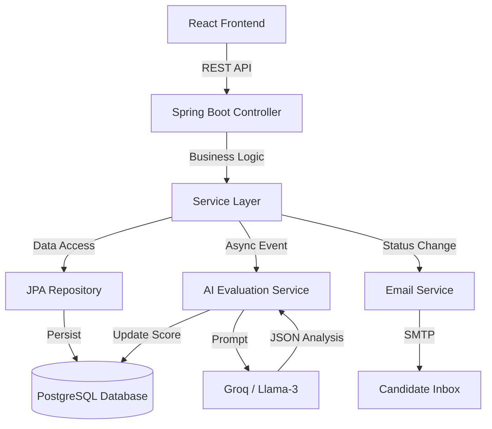
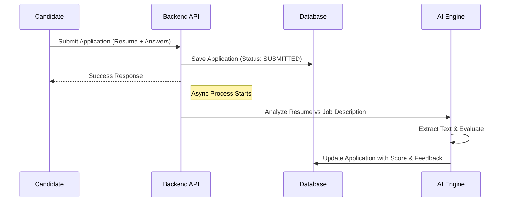
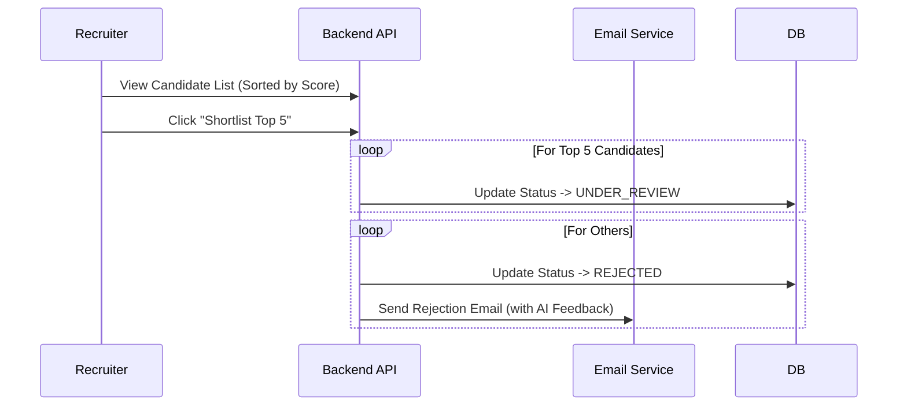

# 📘 PramaanHire - Evidence-Based AI Hiring Platform

> **"Not just faster rejection. Better decisions, backed by evidence."**

PramaanHire is an AI-powered recruitment platform that transforms the traditional ATS (Applicant Tracking System) by introducing **explainable AI evaluation**, **fairness controls**, and **constructive feedback loops**.

---

## 🌐 Live Demo

- **Frontend**: [https://pramaanhire.vercel.app](https://pramaanhire.vercel.app)
- **Backend API**: [https://pramaanhire.onrender.com](https://pramaanhire.onrender.com)
- **Swagger Documentation**: [https://pramaanhire.onrender.com/swagger-ui/index.html](https://pramaanhire.onrender.com/swagger-ui/index.html)

---

## 🌟 Why PramaanHire?

Traditional hiring is broken:
- **HR** is overwhelmed by resume spam.
- **Candidates** are ghosted or rejected without knowing why.
- **AI Tools** are often "black boxes" that introduce bias.

**PramaanHire solves this by:**
1.  **Scoring Evidence, Not Keywords**: AI evaluates the *content* of resumes and screening answers against the job description.
2.  **Closing the Feedback Loop**: Every rejected candidate receives personalized, AI-generated advice on how to improve.
3.  **Protecting Fairness**: Job criteria are locked once applications start to prevent moving goalposts.

---

## 🚀 Key Features

### 👩‍💼 For HR (Recruiters)
- **Smart Job Posting**: Create jobs with custom screening questions (Mandatory/Optional).
- **AI-Assisted Shortlisting**: Instantly see a ranked list of candidates based on an **AI Score (0-100)**.
- **Bulk Actions**: "Shortlist Top 5" automatically moves the best candidates to review and rejects the rest.
- **Deep Insights**: View detailed AI analysis of *why* a candidate is a good fit (Strengths/Weaknesses).
- **Excel Export**: Download full applicant data for offline analysis.

### 👨‍💻 For Candidates
- **Fair Application Process**: Apply with a Resume (PDF) and answer specific screening questions.
- **Transparent Tracking**: Real-time status updates (Submitted → Under Review → Shortlisted).
- **Constructive Rejection**: If rejected, receive an email with **specific, actionable feedback** on skills to improve.
- **Dashboard**: Track all applications and performance trends in one place.

---

## 🏗️ Architecture Overview

PramaanHire follows a robust **Layered Architecture** with asynchronous AI processing.

---

## 🔄 Core Workflows

### 1. The Application Flow

### 2. The Hiring Decision Flow

---

## 🛠️ Tech Stack

- **Backend**: Java 17, Spring Boot 3.3, Spring Security (JWT)
- **Frontend**: React, Vite, Tailwind CSS, Recharts
- **AI Engine**: Spring AI + Groq (Llama-3.3-70b)
- **Database**: PostgreSQL
- **Tools**: Apache PDFBox (Resume Parsing), Apache POI (Excel), Docker

---

## 📚 Documentation

For detailed technical documentation, API endpoints, and setup instructions, please refer to the **[Project Summary](./pramaanhire/PROJECT_SUMMARY.md)**.

---

### 🏃‍♂️ How to Run Locally

1.  **Backend**:
    *   Configure `application.properties` (DB, Mail, Groq API Key).
    *   Run `mvn spring-boot:run`.
2.  **Frontend**:
    *   `cd frontend/frontend`
    *   `npm install`
    *   `npm run dev`
3.  **Access**:
    *   Frontend: `http://localhost:5173`
    *   Swagger API: `http://localhost:8080/swagger-ui.html`

---
*Built for the Future of Hiring.*
